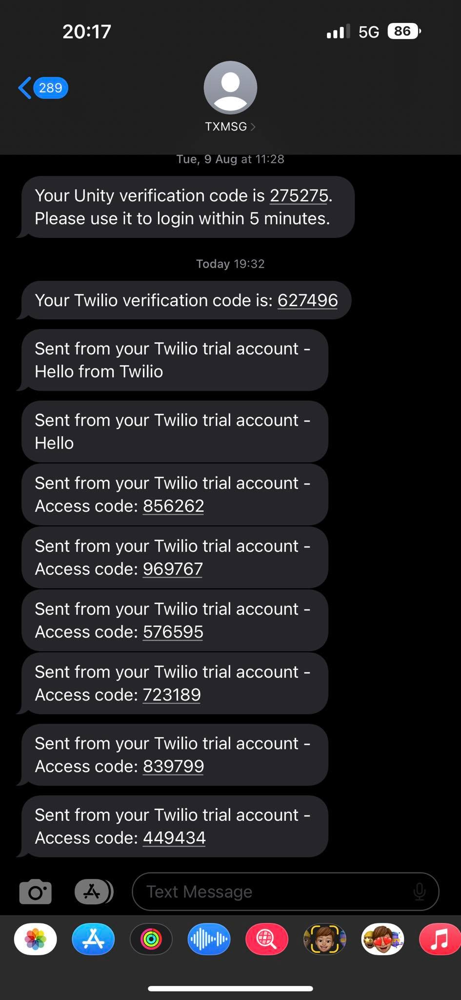

# skipli-interview

## To Run

- Open two terminals
- Run `cd ./backend` and `npm run dev` on first terminal
- Run `cd ./frontend` and `npm run start` on second terminal

## Note

- Twilio only allow to send sms to verified phone on my Twilio account. For now I just added one number `+84913981323`

## Tech stack

- ReactJS (Formik, Yup for form validation)
- TailwindCSS
- ExpressJS
- Firebase Firestore

## Demonstration

- https://drive.google.com/file/d/1bwoMfnGql3xJGyDJFyCS6blMumpG1zTd/view?usp=share_link

## Phone screen

## Structure

